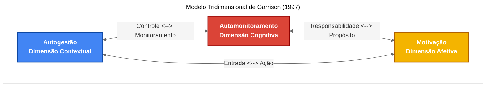

# Representação Visual do Modelo Tridimensional de Garrison

## Explicação do Modelo de Garrison

### Componentes Principais

    

        <strong>1. Autogestão (Dimensão Contextual)</strong> 
        Refere-se ao controle sobre o ambiente de aprendizagem e recursos externos. Envolve o planejamento, implementação e avaliação do processo de aprendizagem, incluindo a definição de metas, identificação de recursos, gerenciamento do tempo e organização do ambiente físico. Esta é a dimensão mais visível e comportamental do modelo.
    

    
    

        <strong>2. Automonitoramento (Dimensão Cognitiva)</strong> 
        Envolve a responsabilidade cognitiva sobre o processo de construção de significado e conhecimento. Inclui atividades metacognitivas como reflexão crítica, integração de novas informações com conhecimentos prévios, estratégias de processamento cognitivo e autorregulação do pensamento. Esta dimensão concentra-se nos processos internos de aprendizagem.
    

    
    

        <strong>3. Motivação (Dimensão Afetiva)</strong> 
        Abrange tanto a motivação inicial para iniciar a tarefa de aprendizagem quanto a motivação para persistir na tarefa. Inclui fatores como auto-eficácia, valor atribuído à tarefa, interesse intrínseco, e compromisso com os objetivos de aprendizagem. Esta dimensão reconhece o papel crucial dos fatores afetivos no processo de autodireção.
    

### Interações Bidirecionais

    

        <strong>Autogestão ↔ Automonitoramento</strong> 
        O controle sobre o ambiente e recursos (autogestão) influencia e é influenciado pelos processos cognitivos e metacognitivos (automonitoramento). Por exemplo, o automonitoramento pode levar à percepção da necessidade de novos recursos, enquanto as escolhas de gestão afetam as oportunidades de processamento cognitivo.
    

    
    

        <strong>Automonitoramento ↔ Motivação</strong> 
        A consciência metacognitiva (automonitoramento) impacta a percepção de progresso e significado, afetando a motivação. Por sua vez, a motivação determina o esforço dedicado às atividades de monitoramento cognitivo e reflexão crítica.
    

    
    

        <strong>Motivação ↔ Autogestão</strong> 
        A motivação determina o nível de engajamento nas atividades de gestão da aprendizagem, enquanto as experiências de controle e sucesso na autogestão reforçam a motivação para continuar no processo de aprendizagem.
    

## Aplicações do Modelo

### Princípios Fundamentais

- **Integração dimensional**: As três dimensões são interdependentes e devem ser desenvolvidas de forma equilibrada para uma aprendizagem autodirigida eficaz.
- **Natureza construtivista**: A aprendizagem significativa é um processo ativo de construção de conhecimento, não apenas aquisição passiva de informações.
- **Dimensões internas e externas**: SDL envolve tanto processos visíveis (comportamentais) quanto invisíveis (cognitivos e afetivos).
- **Papel docente**: Educadores facilitam o desenvolvimento de SDL através de estrutura e suporte inicial que são gradualmente removidos.

### Implicações Práticas

1. **Design educacional**: Ambientes de aprendizagem devem permitir autonomia na gestão, promover reflexão crítica e sustentar motivação.
2. **Avaliação holística**: Práticas avaliativas devem considerar as três dimensões, não apenas resultados comportamentais.
3. **Desenvolvimento de capacidades**: Intervenções pedagógicas específicas podem visar cada dimensão para desenvolver aprendizes autodirigidos.

## Evolução do Modelo

Este modelo, publicado por D.R. Garrison em 1997, representou uma evolução significativa na teoria da aprendizagem autodirigida ao integrar dimensões cognitivas e motivacionais frequentemente negligenciadas, expandindo a compreensão de SDL além do foco tradicional em processos externos de gestão. Foi influenciado por perspectivas construtivistas colaborativas sobre aprendizagem e por teorias de metacognição.

Em desenvolvimentos posteriores, Garrison enfatizou ainda mais a natureza colaborativa da SDL, reconhecendo que a autodireção ocorre não isoladamente, mas dentro de comunidades de aprendizagem onde o significado é negociado socialmente, mantendo a estrutura tridimensional como fundamento para compreender a complexidade da aprendizagem autodirigida.
