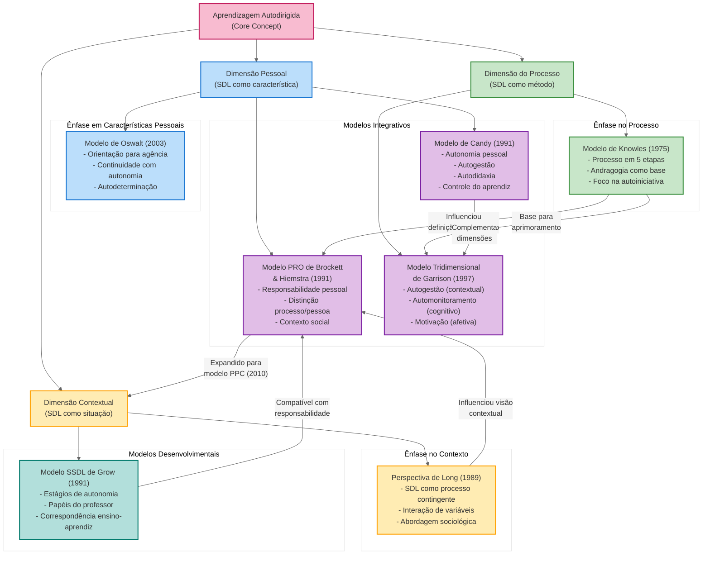

# Mapa Conceitual dos Modelos Teóricos da Aprendizagem Autodirigida (SDL)

## Explicação do Mapa Conceitual dos Modelos Teóricos da SDL

### Estrutura Geral do Mapa

Este mapa conceitual representa as relações entre os principais modelos teóricos da Aprendizagem Autodirigida (Self-Directed Learning - SDL), organizados conforme suas ênfases conceituais e contribuições específicas. O diagrama ilustra como diferentes teóricos abordaram este campo multifacetado, destacando tanto as complementaridades quanto as distinções entre os modelos.

### Dimensões Conceituais da SDL

    

        <strong>Conceito Central</strong> 
        A Aprendizagem Autodirigida representa um fenômeno complexo e multidimensional que envolve o processo pelo qual os indivíduos assumem protagonismo em seu aprendizado, abrangendo tanto aspectos metodológicos quanto características pessoais e influências contextuais.
    

    

        <strong>Dimensão do Processo</strong> 
        Aborda a SDL como método instrucional ou conjunto de procedimentos pedagógicos. Foca nos aspectos externos e comportamentais da autodireção, incluindo planejamento, implementação e avaliação da aprendizagem.
    

    
    

        <strong>Dimensão Pessoal</strong> 
        Considera a SDL como característica ou atributo do aprendiz. Concentra-se em qualidades internas como autonomia, responsabilidade pessoal, autorregulação e disposição para assumir controle sobre o próprio aprendizado.
    

    
    

        <strong>Dimensão Contextual</strong> 
        Examina a SDL como fenômeno situado em contextos sociais, culturais e educacionais específicos. Reconhece que a autodireção não ocorre em um vácuo, mas é moldada por fatores ambientais, oportunidades sociais e restrições institucionais.
    

### Descrição dos Principais Modelos Teóricos

#### Modelos com Ênfase no Processo

    <strong>Modelo de Knowles (1975)</strong> 
    Malcolm Knowles definiu a SDL como "um processo no qual os indivíduos tomam a iniciativa, com ou sem a ajuda de outros, para diagnosticar suas necessidades de aprendizagem, formular metas, identificar recursos, escolher e implementar estratégias apropriadas e avaliar os resultados da aprendizagem". Sua contribuição seminal estabeleceu a concepção da SDL como um processo em cinco etapas e a conectou com princípios andragógicos. O foco está na autoiniciativa do aprendiz dentro de uma estrutura processual clara.

#### Modelos com Ênfase em Características Pessoais

    <strong>Modelo de Oswalt (2003)</strong> 
    Frank Oswalt enfocou a SDL como uma orientação para agência e autodeterminação. Seu trabalho investigou a continuidade entre autonomia e interdependência, considerando a autodireção como característica pessoal que pode ser desenvolvida. Contribuiu para a compreensão de como traços de personalidade e disposições individuais influenciam a capacidade e vontade de engajar-se em aprendizagem autodirigida.

#### Modelos com Ênfase no Contexto

    <strong>Perspectiva de Long (1989)</strong> 
    Huey B. Long conceituou a SDL como um processo contingente, resultante da interação entre múltiplas variáveis. Sua abordagem sociológica reconheceu que a autodireção varia conforme diferentes contextos e situações, rejeitando visões absolutistas. Long criticou as definições simplistas e propôs uma visão da SDL como "comportamento relativo que pode ser contingente à interação de várias variáveis", contribuindo significativamente para a compreensão da dimensão contextual da SDL.

#### Modelos Integrativos

    <strong>Modelo PRO de Brockett & Hiemstra (1991)</strong> 
    O modelo de Orientação de Responsabilidade Pessoal (PRO) distingue entre "aprendizagem autodirigida" (como processo instrucional) e "autodireção do aprendiz" (como característica pessoal), unificados pelo conceito de responsabilidade pessoal. Posteriormente revisado como modelo PPC (Person-Process-Context), reconhece explicitamente a importância do contexto social. Sua principal contribuição foi integrar as dimensões processuais e pessoais da SDL enquanto reconhecia o papel do ambiente sociopolítico.
    
      
    <strong>Modelo Tridimensional de Garrison (1997)</strong> 
    D. Randy Garrison propôs um modelo que integra três dimensões: autogestão (controle contextual), automonitoramento (responsabilidade cognitiva) e motivação (entrada e persistência na tarefa). Este modelo holístico conecta aspectos comportamentais, cognitivos e afetivos da SDL, enfatizando a interação dinâmica entre essas dimensões. Destaca-se por sua abordagem construtivista e pela incorporação de processos metacognitivos como centrais para a SDL efetiva.
    
      
    <strong>Modelo de Candy (1991)</strong> 
    Philip Candy desenvolveu um modelo que distingue quatro dimensões inter-relacionadas: autonomia pessoal (como ideal), autogestão na aprendizagem (como competência), busca independente/autodidaxia (como processo extrainstitucional) e controle do aprendiz na instrução (como direito em contextos formais). Sua contribuição mais significativa foi estabelecer as distinções e conexões entre autodireção como atributo pessoal e como processo, além de analisar profundamente a natureza construtivista do conhecimento na SDL.

#### Modelos Desenvolvimentais

    <strong>Modelo SSDL de Grow (1991)</strong> 
    O Modelo Situacional de Aprendizagem Autodirigida (SSDL) de Gerald Grow descreve quatro estágios de autonomia do aprendiz (dependente, interessado, envolvido, autodirigido) e quatro papéis correspondentes do professor (autoridade/treinador, motivador/guia, facilitador, consultor/delegador). Sua principal contribuição foi a concepção da SDL como capacidade que se desenvolve gradualmente e requer diferentes estilos de ensino em diferentes estágios. O modelo enfatiza a importância da correspondência entre o nível de autodireção do aprendiz e o estilo de ensino.

### Relações e Influências entre os Modelos

    <strong>Continuidades Conceituais:</strong>
    <ul>
        <li>O trabalho seminal de Knowles influenciou praticamente todos os modelos posteriores, estabelecendo um vocabulário e uma estrutura processual básica para a SDL.</li>
        <li>A distinção de Brockett e Hiemstra entre processo e característica pessoal foi incorporada ou adaptada em diversos modelos subsequentes.</li>
        <li>A perspectiva construtivista de Candy sobre conhecimento e aprendizagem complementa o foco de Garrison nos processos metacognitivos.</li>
        <li>A abordagem contextual de Long influenciou a revisão do modelo PRO para o modelo PPC, que deu maior ênfase aos fatores ambientais.</li>
    </ul>
    
    <strong>Complementaridades:</strong>
    <ul>
        <li>O modelo SSDL de Grow complementa o modelo PRO ao oferecer uma perspectiva desenvolvimental sobre como a responsabilidade pessoal pode ser cultivada gradualmente.</li>
        <li>A ênfase de Garrison nos processos metacognitivos amplia a visão processual de Knowles, adicionando uma dimensão cognitiva mais profunda.</li>
        <li>A perspectiva contextual de Long enriquece os modelos mais focados no indivíduo, como o de Oswalt, ao situar a autodireção em estruturas sociais mais amplas.</li>
    </ul>
    
    <strong>Desenvolvimentos Evolutivos:</strong>
    <ul>
        <li>Os modelos avançaram de concepções processuais relativamente simples (Knowles) para estruturas multidimensionais que reconhecem a complexidade da SDL.</li>
        <li>Houve uma evolução de modelos focados no indivíduo para aqueles que reconhecem explicitamente a importância do contexto sociocultural e institucional.</li>
        <li>Os modelos mais recentes tendem a ser mais integrativos, reconhecendo a interdependência entre processos, características pessoais e fatores contextuais.</li>
    </ul>

### Implicações para Pesquisa e Prática Educacional

Este mapa conceitual oferece várias implicações importantes:

1. **Visão holística**: A SDL deve ser compreendida como um fenômeno multidimensional, não apenas como um método ou característica isolada.

2. **Complementaridade teórica**: Os diversos modelos não são contraditórios, mas oferecem perspectivas complementares que, juntas, enriquecem nossa compreensão da autodireção na aprendizagem.

3. **Flexibilidade contextual**: Educadores devem considerar não apenas características individuais e processos, mas também como o contexto facilita ou restringe oportunidades para autodireção.

4. **Desenvolvimento progressivo**: A SDL pode ser cultivada através de abordagens que reconhecem diferentes níveis de prontidão e proporcionam suporte apropriado para cada estágio.

5. **Base para design instrucional**: O mapa fornece fundamentos teóricos para o desenvolvimento de ambientes de aprendizagem que promovam gradualmente maior autonomia e responsabilidade dos aprendizes.

## Conclusão

Os modelos teóricos da SDL representam uma rica tapeçaria conceitual que ilumina diferentes aspectos deste fenômeno complexo. Juntos, fornecem um quadro abrangente para compreender a interação dinâmica entre processos instrucionais, características pessoais e contextos socioculturais na promoção da autodireção na aprendizagem. Esta compreensão integrativa é essencial para o desenvolvimento de práticas educacionais que efetivamente capacitem os aprendizes a assumir maior controle sobre seus processos de aprendizagem em uma sociedade em rápida transformação.
