# Matriz do Modelo Situacional de Aprendizagem Autodirigida (SSDL) de Grow

```mermaid
%%{init: {
  'theme': 'base',
  'themeVariables': {
    'primaryColor': '#f5f5f5',
    'primaryTextColor': '#333',
    'primaryBorderColor': '#aaa',
    'lineColor': '#666',
    'fontSize': '16px'
  }
}}%%

graph LR
    classDef estagioAprendiz fill:#6D71F9,stroke:#3b41e3,stroke-width:2px,color:white,font-weight:bold
    classDef papelProfessor fill:#FF9248,stroke:#e06c1b,stroke-width:2px,color:white,font-weight:bold
    classDef conteudo fill:#f5f5f5,stroke:#cccccc,stroke-width:1px,color:#333
    classDef metodo fill:#E2F0CB,stroke:#A9CC76,stroke-width:1px,color:#333

    subgraph Matrix["Matriz do Modelo SSDL de Grow (1991)"]
        subgraph Stage1["Estágio 1"]
            A1[Aprendiz<br/>Dependente]:::estagioAprendiz
            P1[Professor<br/>Autoridade/Treinador]:::papelProfessor
            C1[Características:<br/>• Necessita de direção<br/>• Pouca experiência<br/>• Motivação externa<br/>• Confia no professor]:::conteudo
            M1[Métodos Apropriados:<br/>• Aulas expositivas<br/>• Treinamento<br/>• Feedback imediato<br/>• Exercícios estruturados]:::metodo
        end

        subgraph Stage2["Estágio 2"]
            A2[Aprendiz<br/>Interessado]:::estagioAprendiz
            P2[Professor<br/>Motivador/Guia]:::papelProfessor
            C2[Características:<br/>• Receptivo<br/>• Mais confiante<br/>• Motivação crescente<br/>• Responde a incentivos]:::conteudo
            M2[Métodos Apropriados:<br/>• Palestras motivacionais<br/>• Discussões guiadas<br/>• Objetivos definidos<br/>• Estratégias de estudo]:::metodo
        end

        subgraph Stage3["Estágio 3"]
            A3[Aprendiz<br/>Envolvido]:::estagioAprendiz
            P3[Professor<br/>Facilitador]:::papelProfessor
            C3[Características:<br/>• Conhecimento básico<br/>• Participante ativo<br/>• Vê-se como participante<br/>• Exploração independente]:::conteudo
            M3[Métodos Apropriados:<br/>• Discussões em grupo<br/>• Seminários<br/>• Projetos colaborativos<br/>• Aprendizagem baseada em problemas]:::metodo
        end

        subgraph Stage4["Estágio 4"]
            A4[Aprendiz<br/>Autodirigido]:::estagioAprendiz
            P4[Professor<br/>Consultor/Delegador]:::papelProfessor
            C4[Características:<br/>• Define objetivos<br/>• Autoiniciativa<br/>• Independência<br/>• Compromisso<br/>• Autoavaliação]:::conteudo
            M4[Métodos Apropriados:<br/>• Trabalho independente<br/>• Estágios<br/>• Projetos individuais<br/>• Estudos autodirigidos<br/>• Mentoria]:::metodo
        end

        %% Conexões de progressão
        Stage1 --> |"Transição"| Stage2
        Stage2 --> |"Transição"| Stage3
        Stage3 --> |"Transição"| Stage4
    end
```

## Legenda e Descrição do Modelo SSDL

### Visão Geral do Modelo

    <strong>O Modelo Situacional de Aprendizagem Autodirigida (SSDL)</strong> desenvolvido por Gerald Grow (1991) propõe que os aprendizes progridem através de quatro estágios de autonomia crescente, e que os professores devem adaptar seus estilos de ensino para corresponder a esses estágios. O modelo enfatiza que a autodireção não é apenas um traço de personalidade, mas uma característica situacional que varia conforme o contexto e a matéria, podendo ser desenvolvida progressivamente através de intervenções pedagógicas apropriadas.

### Descrição dos Estágios e Papéis

    

        <strong>Estágios do Aprendiz</strong> 
        Representam os níveis progressivos de autonomia e autodireção que os estudantes desenvolvem, desde a dependência completa até a capacidade de aprendizagem autodirigida.
    

    
    

        <strong>Papéis do Professor</strong> 
        Correspondem aos diferentes estilos de ensino que o educador deve adotar para atender às necessidades dos aprendizes em cada estágio, desde a autoridade que fornece direção clara até o consultor que apoia iniciativas independentes.
    

### Descrição Detalhada dos Estágios

#### Estágio 1: Aprendiz Dependente ↔ Professor Autoridade/Treinador

    <strong>Características do Aprendiz:</strong> Possui pouca experiência prévia com o conteúdo, baixa confiança para trabalhar de forma independente, e necessita de direção clara e feedback imediato. A motivação é frequentemente externa, baseada em notas ou aprovação.
    
      
    <strong>Papel do Professor:</strong> Fornece instruções claras e estruturadas, estabelece objetivos de aprendizagem específicos, oferece feedback frequente e imediato, e modela o comportamento esperado. Utiliza aulas expositivas, demonstrações e exercícios com respostas definidas.

#### Estágio 2: Aprendiz Interessado ↔ Professor Motivador/Guia

    <strong>Características do Aprendiz:</strong> Demonstra interesse e receptividade, responde positivamente à motivação, possui alguma confiança em suas habilidades, mas ainda precisa de direção e estrutura. Começa a ver a relevância pessoal do conteúdo.
    
      
    <strong>Papel do Professor:</strong> Motiva e inspira, explicando o raciocínio por trás das tarefas, ainda estabelece objetivos, mas começa a integrar os interesses dos alunos. Utiliza discussões guiadas, demonstrações inspiradoras e ensina estratégias de aprendizagem.

#### Estágio 3: Aprendiz Envolvido ↔ Professor Facilitador

    <strong>Características do Aprendiz:</strong> Possui conhecimentos e habilidades substanciais, vê-se como participante ativo no processo educacional, demonstra capacidade para exploração crítica e colaboração, estabelece alguns objetivos próprios.
    
      
    <strong>Papel do Professor:</strong> Facilita o processo de aprendizagem, atuando como parceiro do aluno, encoraja a participação e exploração, compartilha decisões sobre conteúdo e métodos. Utiliza discussões em seminários, projetos em grupo e métodos de investigação guiada.

#### Estágio 4: Aprendiz Autodirigido ↔ Professor Consultor/Delegador

    <strong>Características do Aprendiz:</strong> Estabelece objetivos próprios, seleciona estratégias adequadas, gerencia recursos, avalia seu próprio progresso, assume responsabilidade pela própria aprendizagem, e busca desafios que ampliem seu conhecimento.
    
      
    <strong>Papel do Professor:</strong> Consulta e delega, cultiva a capacidade do aprendiz para aprendizagem independente, promove autonomia e iniciativa, não direciona, mas serve como recurso quando necessário. Utiliza projetos independentes, pesquisas autodirigidas e contratos de aprendizagem.

### Desajustes e suas Consequências

    <strong>Desajustes Severos:</strong>
    <ul>
        <li><strong>Professor Delegador com Aprendiz Dependente (S1/T4)</strong> - Resulta em "negligência instrucional", onde o aluno se sente abandonado, frustrado e ansioso.</li>
        <li><strong>Professor Autoridade com Aprendiz Autodirigido (S4/T1)</strong> - Causa rebelião, resistência ou dependência regressiva no aluno que vê sua autonomia inibida.</li>
    </ul>
    
    <strong>Desajustes Moderados:</strong>
    <ul>
        <li><strong>Professor Autoridade com Aprendiz Envolvido (S3/T1)</strong> - O aluno sente sua participação restringida e torna-se passivo ou resistente.</li>
        <li><strong>Professor Delegador com Aprendiz Interessado (S2/T4)</strong> - O aluno sente-se sobrecarregado pela falta de estrutura e perde motivação.</li>
    </ul>

### Estratégias para Transição entre Estágios

    <strong>Estratégias para desenvolver maior autodireção:</strong>
    <ul>
        <li>Introduzir gradualmente escolhas em atividades estruturadas</li>
        <li>Ensinar explicitamente habilidades de estudo independente</li>
        <li>Usar contratos de aprendizagem com responsabilidade crescente</li>
        <li>Modelar o comportamento autodirigido</li>
        <li>Fornecer feedback que promova a reflexão e autorregulação</li>
        <li>Criar ambientes que recompensem a iniciativa e a autonomia</li>
        <li>Reduzir progressivamente o scaffolding (suporte) instrucional</li>
    </ul>

## Aplicações e Implicações do Modelo SSDL

### Implicações para o Design Instrucional

O modelo SSDL sugere que o design educacional deve:

- Incluir múltiplos níveis de suporte que possam ser gradualmente removidos
- Proporcionar experiências educacionais que avancem progressivamente em complexidade e autonomia
- Estabelecer estruturas de avaliação que reconheçam e valorizem diferentes níveis de autodireção
- Criar ambientes de aprendizagem flexíveis que possam acomodar diferentes estágios de desenvolvimento

### Implicações para a Formação de Professores

Para os educadores, o modelo destaca a importância de:

- Desenvolver versatilidade metodológica para atender aprendizes em diferentes estágios
- Cultivar habilidades diagnósticas para identificar o nível de autodireção dos estudantes
- Adquirir competências para facilitar transições suaves entre os estágios
- Balancear a necessidade de dar suporte com a importância de desenvolver autonomia

### Limitações e Considerações

- O modelo simplifica um processo de desenvolvimento complexo em quatro estágios
- A autodireção pode variar significativamente entre diferentes domínios e tarefas
- Fatores culturais, educacionais e individuais influenciam a preferência e prontidão para autodireção
- O contexto institucional pode facilitar ou limitar a implementação do modelo
