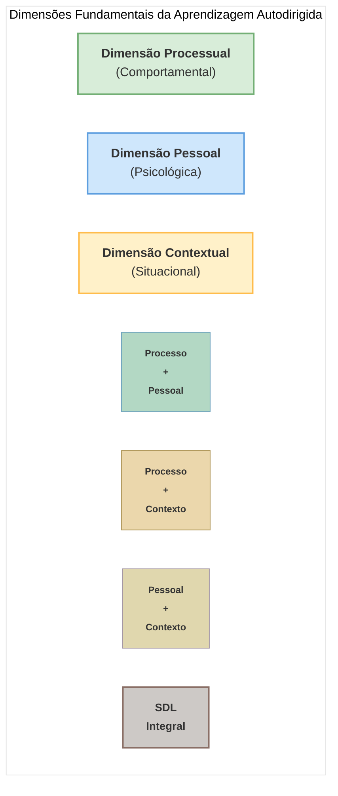

# Diagrama Venn das Dimensões da Aprendizagem Autodirigida (SDL)

## Descrição das Dimensões Fundamentais

### Dimensão Processual (Comportamental)

    <strong>Definição:</strong> A dimensão processual refere-se aos aspectos observáveis e sequenciais da aprendizagem autodirigida, enfocando o "como" da SDL. Abrange as ações, procedimentos e métodos que os aprendizes utilizam para gerenciar sua própria aprendizagem.
    
      
    <strong>Características-chave:</strong>
    <ul>
        <li>Planejamento e estabelecimento de objetivos de aprendizagem</li>
        <li>Identificação e utilização de recursos apropriados</li>
        <li>Implementação de estratégias de aprendizagem</li>
        <li>Monitoramento do progresso da aprendizagem</li>
        <li>Avaliação de resultados e reflexão sobre o processo</li>
    </ul>
    
     
    <strong>Representantes teóricos:</strong> Malcolm Knowles, destacando o processo em cinco etapas; Allen Tough, com foco em projetos de aprendizagem

### Dimensão Pessoal (Psicológica)

    <strong>Definição:</strong> A dimensão pessoal engloba os atributos, disposições e características internas do aprendiz que o predispõem a assumir responsabilidade pela própria aprendizagem. Refere-se ao "quem" da SDL.
    
      
    <strong>Características-chave:</strong>
    <ul>
        <li>Autonomia e independência</li>
        <li>Motivação intrínseca e autoeficácia</li>
        <li>Iniciativa e proatividade</li>
        <li>Autorregulação e disciplina</li>
        <li>Pensamento crítico e habilidades metacognitivas</li>
    </ul>
    
     
    <strong>Representantes teóricos:</strong> Guglielmino, enfatizando a prontidão para SDL; Candy, com o conceito de autonomia pessoal; Oswalt, destacando a agência e autodeterminação

### Dimensão Contextual (Situacional)

    <strong>Definição:</strong> A dimensão contextual refere-se aos fatores ambientais, sociais e situacionais que influenciam as oportunidades e restrições para a aprendizagem autodirigida. Concentra-se no "onde" e "quando" da SDL.
    
      
    <strong>Características-chave:</strong>
    <ul>
        <li>Recursos e oportunidades disponíveis no ambiente</li>
        <li>Suporte social e cultural para autonomia</li>
        <li>Estruturas institucionais e políticas educacionais</li>
        <li>Influências socioeconômicas</li>
        <li>Tecnologias e ferramentas acessíveis</li>
    </ul>
    
     
    <strong>Representantes teóricos:</strong> Huey Long, com SDL como processo contingente; Brookfield, destacando o contexto sociocultural; Hiemstra, enfatizando ambientes de aprendizagem

## Intersecções entre as Dimensões

### Processo + Pessoal

    <strong>Interrelação:</strong> A intersecção entre as dimensões processual e pessoal representa como as características do aprendiz influenciam a execução dos processos de SDL e, inversamente, como o engajamento em processos autodirigidos desenvolve atributos pessoais.
    
      
    <strong>Exemplos:</strong>
    <ul>
        <li>Autorregulação: processo de monitoramento influenciado por capacidades metacognitivas</li>
        <li>Autoeficácia desenvolvida através de experiências bem-sucedidas de planejamento e implementação</li>
        <li>Estratégias de aprendizagem personalizadas de acordo com preferências e estilos individuais</li>
    </ul>
    
     
    <strong>Modelo teórico relacionado:</strong> Modelo PRO de Brockett & Hiemstra, que distingue entre SDL como processo instrucional e autodireção do aprendiz como característica pessoal

### Processo + Contexto

    <strong>Interrelação:</strong> Esta intersecção explora como os processos de SDL são moldados por fatores contextuais e como os aprendizes adaptam seus processos às oportunidades e restrições ambientais.
    
      
    <strong>Exemplos:</strong>
    <ul>
        <li>Adaptação de estratégias de aprendizagem com base nos recursos disponíveis</li>
        <li>Processos estruturados por políticas institucionais e expectativas sociais</li>
        <li>Identificação de oportunidades de aprendizagem em comunidades de prática</li>
        <li>Aproveitamento de tecnologias para implementar processos de SDL</li>
    </ul>
    
     
    <strong>Modelo teórico relacionado:</strong> Abordagem de Garrison sobre autogestão como dimensão contextual que envolve o controle sobre tarefas de aprendizagem

### Pessoal + Contexto

    <strong>Interrelação:</strong> A intersecção entre as dimensões pessoal e contextual revela como o ambiente molda as características do aprendiz e como, por sua vez, os atributos pessoais influenciam a percepção e interação com o contexto.
    
      
    <strong>Exemplos:</strong>
    <ul>
        <li>Desenvolvimento da autonomia em ambientes que valorizam e apoiam a independência</li>
        <li>Variação cultural na expressão e valorização de características autodirigidas</li>
        <li>Adaptabilidade como disposição pessoal para responder a diferentes contextos</li>
        <li>Percepção de controle em ambientes de aprendizagem restritivos versus permissivos</li>
    </ul>
    
     
    <strong>Modelo teórico relacionado:</strong> Modelo PPC (Person-Process-Context) de Brockett & Hiemstra (2012), revisão do modelo PRO que enfatiza a importância do contexto

### SDL Integral (Interseção das Três Dimensões)

    <strong>Interrelação:</strong> O centro do diagrama representa a compreensão holística da SDL como fenômeno que integra simultaneamente processos comportamentais, características pessoais e influências contextuais.
    
      
    <strong>Manifestações:</strong>
    <ul>
        <li>Aprendizagem transformativa que muda perspectivas pessoais através de processos específicos em contextos facilitadores</li>
        <li>Comunidades de aprendizagem autodirigida onde processos, pessoas e ambientes estão alinhados</li>
        <li>Desenvolvimento profissional autodirigido eficaz em organizações de aprendizagem</li>
        <li>Experiências educacionais que equilibram estrutura com autonomia e atendem às necessidades individuais</li>
    </ul>
    
     
    <strong>Modelos teóricos integrais:</strong> Modelo Tridimensional de Garrison (integrando autogestão, automonitoramento e motivação); Modelo de Candy (conectando autonomia pessoal, autogestão, controle do aprendiz e autodidaxia)

## Implicações para a Prática Educacional

    <strong>Para Educadores:</strong>
    <ul>
        <li>Reconhecer a complexidade da SDL como fenômeno multidimensional, evitando reduzi-la a apenas uma de suas dimensões</li>
        <li>Desenvolver intervenções que abordem os processos (como fazer), as características pessoais (disposições) e o contexto (ambiente facilitador)</li>
        <li>Adaptar estratégias para promover SDL com base na avaliação das três dimensões</li>
        <li>Criar ambientes que equilibrem estrutura e liberdade para apoiar o desenvolvimento da autodireção</li>
    </ul>
    
    <strong>Para Pesquisadores:</strong>
    <ul>
        <li>Adotar perspectivas multidimensionais e integradas ao investigar a SDL</li>
        <li>Desenvolver instrumentos de avaliação que capturem as três dimensões e suas interações</li>
        <li>Considerar as intersecções entre dimensões como áreas férteis para investigação</li>
        <li>Explorar como diferentes contextos culturais e educacionais influenciam os processos e características da SDL</li>
    </ul>
    
    <strong>Para Aprendizes:</strong>
    <ul>
        <li>Desenvolver consciência das próprias características pessoais relacionadas à SDL</li>
        <li>Adquirir competências processuais para gerenciar a própria aprendizagem</li>
        <li>Aprender a identificar e aproveitar oportunidades contextuais para autodireção</li>
        <li>Reconhecer que a SDL eficaz envolve a integração das três dimensões</li>
    </ul>

## Conclusão

O Diagrama Venn das Dimensões da SDL oferece uma representação visual da natureza multifacetada da aprendizagem autodirigida. Este quadro conceitual reconhece que a SDL não pode ser reduzida apenas a um conjunto de processos, características pessoais ou fatores contextuais isolados, mas emerge da interação dinâmica entre essas três dimensões.

Ao considerar a SDL através desta lente tridimensional, educadores, pesquisadores e aprendizes podem desenvolver uma compreensão mais rica e matizada deste fenômeno complexo. As intersecções entre as dimensões revelam áreas particularmente interessantes para análise e intervenção, destacando como processos, pessoas e contextos se influenciam mutuamente na promoção da aprendizagem autodirigida eficaz.

Esta visão integrada alinha-se com a evolução do campo, que progrediu de concepções mais simplistas e unidimensionais para modelos mais holísticos que reconhecem a interdependência de múltiplos fatores na autodireção na aprendizagem.
