# Infográfico das Competências Essenciais da Aprendizagem Autodirigida (SDL)

```mermaid
mindmap
  root[Competências<br/>Essenciais<br/>para SDL]
    style root fill:#7E57C2,stroke:#4527A0,color:#FFF

    %% COMPETÊNCIAS METACOGNITIVAS
    metacog[Metacognição]
    style metacog fill:#5C6BC0,stroke:#303F9F,color:#FFF

      ::icon(fa fa-brain)
      metacog-->autoconhecimento[Auto-conhecimento<br/>como aprendiz]
      style autoconhecimento fill:#7986CB,stroke:#303F9F,color:#FFF
        autoconhecimento-->estilo[Reconhecimento do<br/>estilo de aprendizagem]
        autoconhecimento-->pontoforte[Identificação de<br/>pontos fortes e fracos]

      metacog-->planejamentoCognitivo[Planejamento<br/>cognitivo]
      style planejamentoCognitivo fill:#7986CB,stroke:#303F9F,color:#FFF
        planejamentoCognitivo-->estratégias[Seleção de estratégias<br/>cognitivas adequadas]
        planejamentoCognitivo-->sequenciamento[Sequenciamento<br/>de etapas]

      metacog-->automonitoramento[Automonitoramento]
      style automonitoramento fill:#7986CB,stroke:#303F9F,color:#FFF
        automonitoramento-->progresso[Monitoramento<br/>do progresso]
        automonitoramento-->compreensão[Verificação da<br/>compreensão]

    %% COMPETÊNCIAS AUTORREGULATÓRIAS
    autoreg[Autorregulação]
    style autoreg fill:#26A69A,stroke:#00796B,color:#FFF

      ::icon(fa fa-arrows-spin)
      autoreg-->controleMotivacional[Controle<br/>motivacional]
      style controleMotivacional fill:#4DB6AC,stroke:#00796B,color:#FFF
        controleMotivacional-->interesse[Manutenção<br/>do interesse]
        controleMotivacional-->persistência[Persistência<br/>diante de desafios]

      autoreg-->controleEmocional[Controle<br/>emocional]
      style controleEmocional fill:#4DB6AC,stroke:#00796B,color:#FFF
        controleEmocional-->ansiedade[Gerenciamento<br/>da ansiedade]
        controleEmocional-->frustração[Tolerância à<br/>frustração]

      autoreg-->gestãoTempo[Gestão<br/>do tempo]
      style gestãoTempo fill:#4DB6AC,stroke:#00796B,color:#FFF
        gestãoTempo-->priorização[Priorização<br/>de tarefas]
        gestãoTempo-->cronograma[Elaboração de<br/>cronogramas realistas]

    %% COMPETÊNCIAS DE METAS
    metas[Estabelecimento<br/>de Metas]
    style metas fill:#EF5350,stroke:#D32F2F,color:#FFF

      ::icon(fa fa-bullseye)
      metas-->metasAprendizagem[Metas de<br/>aprendizagem]
      style metasAprendizagem fill:#EF9A9A,stroke:#D32F2F,color:#FFF
        metasAprendizagem-->específicas[Metas SMART:<br/>específicas e mensuráveis]
        metasAprendizagem-->significativas[Metas alinhadas<br/>com interesses pessoais]

      metas-->hierarquiaMetas[Hierarquia<br/>de metas]
      style hierarquiaMetas fill:#EF9A9A,stroke:#D32F2F,color:#FFF
        hierarquiaMetas-->curtoPrazo[Objetivos de<br/>curto prazo]
        hierarquiaMetas-->longoPrazo[Objetivos de<br/>longo prazo]

    %% COMPETÊNCIAS DE GESTÃO DE RECURSOS
    recursos[Gestão de<br/>Recursos]
    style recursos fill:#66BB6A,stroke:#388E3C,color:#FFF

      ::icon(fa fa-toolbox)
      recursos-->identificação[Identificação<br/>de recursos]
      style identificação fill:#81C784,stroke:#388E3C,color:#FFF
        identificação-->fontes[Localização de<br/>fontes de informação]
        identificação-->materiais[Seleção de<br/>materiais adequados]

      recursos-->ambientais[Recursos<br/>ambientais]
      style ambientais fill:#81C784,stroke:#388E3C,color:#FFF
        ambientais-->físico[Organização do<br/>espaço físico]
        ambientais-->digital[Utilização de<br/>ambientes digitais]

      recursos-->sociais[Recursos<br/>sociais]
      style sociais fill:#81C784,stroke:#388E3C,color:#FFF
        sociais-->redes[Construção de<br/>redes de apoio]
        sociais-->feedback[Solicitação de<br/>feedback]

    %% COMPETÊNCIAS DE AVALIAÇÃO
    avaliação[Avaliação<br/>Reflexiva]
    style avaliação fill:#FF9800,stroke:#F57C00,color:#FFF

      ::icon(fa fa-scale-balanced)
      avaliação-->autoavaliação[Autoavaliação<br/>crítica]
      style autoavaliação fill:#FFB74D,stroke:#F57C00,color:#FFF
        autoavaliação-->critérios[Definição de<br/>critérios próprios]
        autoavaliação-->resultados[Análise de<br/>resultados]

      avaliação-->reflexão[Reflexão<br/>sobre o processo]
      style reflexão fill:#FFB74D,stroke:#F57C00,color:#FFF
        reflexão-->aprendizados[Extração de<br/>aprendizados]
        reflexão-->transferência[Transferência para<br/>novos contextos]

      avaliação-->ajuste[Ajuste<br/>contínuo]
      style ajuste fill:#FFB74D,stroke:#F57C00,color:#FFF
        ajuste-->estratégias[Refinamento de<br/>estratégias]
        ajuste-->adaptação[Adaptação a<br/>novas condições]
```

## Descrição dos Grupos de Competências

### 1. Metacognição (Competências Metacognitivas)

A metacognição representa a capacidade de "pensar sobre o próprio pensamento" e é fundamental para a aprendizagem autodirigida. Envolve:

- **Autoconhecimento como aprendiz**: Consciência das próprias preferências, capacidades e limitações no processo de aprendizagem.

  - _Reconhecimento do estilo de aprendizagem_: Identificar se aprende melhor por meio visual, auditivo, cinestésico ou combinações.
  - _Identificação de pontos fortes e fracos_: Reconhecer áreas em que se tem facilidade ou dificuldade de aprendizagem.

- **Planejamento cognitivo**: Capacidade de organizar mentalmente as etapas necessárias para a aprendizagem.

  - _Seleção de estratégias cognitivas adequadas_: Escolher abordagens eficazes para diferentes tipos de conteúdo.
  - _Sequenciamento de etapas_: Ordenar logicamente as fases do processo de aprendizagem.

- **Automonitoramento**: Acompanhamento constante do próprio processo de compreensão e aprendizagem.
  - _Monitoramento do progresso_: Verificar continuamente se está avançando conforme planejado.
  - _Verificação da compreensão_: Questionar-se para confirmar o entendimento real do conteúdo.

### 2. Autorregulação (Competências Autorregulatórias)

A autorregulação refere-se à capacidade de controlar aspectos emocionais, motivacionais e comportamentais durante o processo de aprendizagem:

- **Controle motivacional**: Capacidade de manter-se motivado e engajado.

  - _Manutenção do interesse_: Estratégias para sustentar o envolvimento mesmo em tópicos menos atraentes.
  - _Persistência diante de desafios_: Capacidade de continuar apesar de dificuldades ou obstáculos.

- **Controle emocional**: Gerenciamento das emoções que surgem durante o processo de aprendizagem.

  - _Gerenciamento da ansiedade_: Técnicas para reduzir a tensão durante situações desafiadoras.
  - _Tolerância à frustração_: Capacidade de lidar com reveses e falhas sem desistir.

- **Gestão do tempo**: Organização eficaz do tempo disponível para a aprendizagem.
  - _Priorização de tarefas_: Identificar o que é mais importante e urgente.
  - _Elaboração de cronogramas realistas_: Criar planejamentos temporais viáveis e equilibrados.

### 3. Estabelecimento de Metas (Competências de Direcionamento)

O estabelecimento de metas refere-se à capacidade de definir objetivos claros e alcançáveis:

- **Metas de aprendizagem**: Definição dos resultados esperados do processo de aprendizagem.

  - _Metas SMART: específicas e mensuráveis_: Objetivos bem definidos, mensuráveis, alcançáveis, relevantes e com prazo.
  - _Metas alinhadas com interesses pessoais_: Objetivos que têm significado e valor para o aprendiz.

- **Hierarquia de metas**: Organização de objetivos em diferentes níveis e prazos.
  - _Objetivos de curto prazo_: Metas imediatas que ajudam a manter o progresso visível.
  - _Objetivos de longo prazo_: Metas maiores que orientam a direção geral da aprendizagem.

### 4. Gestão de Recursos (Competências Instrumentais)

A gestão de recursos envolve a capacidade de identificar, selecionar e utilizar eficientemente os recursos disponíveis:

- **Identificação de recursos**: Capacidade de localizar e avaliar fontes de informação e aprendizagem.

  - _Localização de fontes de informação_: Encontrar materiais relevantes em bibliotecas, internet, especialistas.
  - _Seleção de materiais adequados_: Avaliar criticamente a qualidade e relevância das fontes.

- **Recursos ambientais**: Otimização do ambiente físico e digital para a aprendizagem.

  - _Organização do espaço físico_: Criar um ambiente que minimize distrações e maximize o foco.
  - _Utilização de ambientes digitais_: Aproveitar plataformas online, aplicativos e ferramentas digitais.

- **Recursos sociais**: Aproveitamento de interações sociais para potencializar a aprendizagem.
  - _Construção de redes de apoio_: Desenvolver conexões com mentores, colegas e comunidades de prática.
  - _Solicitação de feedback_: Buscar ativamente avaliações e sugestões de outros.

### 5. Avaliação Reflexiva (Competências Avaliativas)

A avaliação reflexiva envolve a análise crítica do próprio processo e resultados de aprendizagem:

- **Autoavaliação crítica**: Capacidade de julgar objetivamente o próprio desempenho.

  - _Definição de critérios próprios_: Estabelecer padrões pessoais significativos para avaliar o sucesso.
  - _Análise de resultados_: Examinar objetivamente os produtos da aprendizagem.

- **Reflexão sobre o processo**: Consideração consciente sobre como a aprendizagem ocorreu.

  - _Extração de aprendizados_: Identificar lições além do conteúdo específico estudado.
  - _Transferência para novos contextos_: Aplicar o aprendido em situações diferentes.

- **Ajuste contínuo**: Capacidade de adaptar estratégias com base nas reflexões.
  - _Refinamento de estratégias_: Modificar abordagens que não estão funcionando bem.
  - _Adaptação a novas condições_: Flexibilidade para responder a mudanças nas circunstâncias.

## Níveis de Desenvolvimento das Competências

As competências para SDL podem ser desenvolvidas em diferentes níveis:

| Nível             | Descrição                                    | Características                                                                                                                |
| ----------------- | -------------------------------------------- | ------------------------------------------------------------------------------------------------------------------------------ |
| **Iniciante**     | Desenvolvimento inicial das competências     | Requer orientação externa, tem consciência limitada do processo, depende de estruturas fornecidas por outros                   |
| **Intermediário** | Desenvolvimento parcial das competências     | Alterna entre autonomia e dependência, tem consciência moderada do processo, consegue estruturar parcialmente sua aprendizagem |
| **Avançado**      | Desenvolvimento substancial das competências | Demonstra autonomia consistente, tem alta consciência do processo, cria estruturas próprias eficazes                           |
| **Especialista**  | Domínio completo das competências            | Autonomia total, metacognição sofisticada, adaptação fluida a diferentes contextos, capaz de inovar em suas abordagens         |

## Interrelações entre Competências

As competências essenciais para SDL não funcionam isoladamente, mas formam um sistema integrado:

- A **metacognição** fundamenta todas as outras competências, fornecendo a consciência necessária para a autorregulação, estabelecimento de metas, gestão de recursos e avaliação.

- A **autorregulação** permite a persistência necessária para alcançar metas, utilizar recursos eficientemente e manter o processo de avaliação contínua.

- O **estabelecimento de metas** orienta o foco da metacognição, direciona os esforços de autorregulação, determina quais recursos serão necessários e estabelece critérios para avaliação.

- A **gestão de recursos** proporciona as ferramentas e condições necessárias para implementar estratégias metacognitivas, apoiar a autorregulação, perseguir metas e fornecer insumos para avaliação.

- A **avaliação reflexiva** fecha o ciclo fornecendo informações para refinar a metacognição, ajustar a autorregulação, revisar metas e otimizar o uso de recursos.

## Implicações para o Desenvolvimento da SDL

O desenvolvimento integrado destas competências essenciais tem implicações importantes:

1. **Progressão não-linear**: As competências não se desenvolvem uniformemente nem em uma sequência fixa.

2. **Especificidade contextual**: A manifestação das competências varia conforme o domínio de conhecimento e contexto de aprendizagem.

3. **Interdependência**: O fortalecimento de uma competência geralmente impacta positivamente as outras.

4. **Potencial para desenvolvimento**: Todas as competências podem ser desenvolvidas mediante prática deliberada e feedback adequado.

5. **Flexibilidade adaptativa**: Aprendizes autodirigidos eficazes ajustam quais competências priorizar conforme as demandas da situação.
