# Perfil Visual do Aprendiz Autodirigido

```mermaid
graph TD
    %% Nó Central
    Aprendiz((Aprendiz<br/>Autodirigido))
    style Aprendiz fill:#7E57C2,stroke:#4527A0,color:#FFF,stroke-width:3px,font-weight:bold

    %% Categorias Principais
    MotivacionalCat[Dimensão Motivacional]
    style MotivacionalCat fill:#FB8C00,stroke:#EF6C00,color:#FFF,stroke-width:2px,font-weight:bold

    CognitivaCat[Dimensão Cognitiva]
    style CognitivaCat fill:#1E88E5,stroke:#1565C0,color:#FFF,stroke-width:2px,font-weight:bold

    ComportamentalCat[Dimensão Comportamental]
    style ComportamentalCat fill:#43A047,stroke:#2E7D32,color:#FFF,stroke-width:2px,font-weight:bold

    %% Conexões com o centro
    Aprendiz --- MotivacionalCat
    Aprendiz --- CognitivaCat
    Aprendiz --- ComportamentalCat

    %% Características Motivacionais
    MI[Motivação<br/>Intrínseca]
    style MI fill:#FFB74D,stroke:#EF6C00,color:#333,stroke-width:1px

    Autonomia[Autonomia]
    style Autonomia fill:#FFB74D,stroke:#EF6C00,color:#333,stroke-width:1px

    Auto_Eficacia[Auto-eficácia]
    style Auto_Eficacia fill:#FFB74D,stroke:#EF6C00,color:#333,stroke-width:1px

    %% Características Cognitivas
    PC[Pensamento<br/>Crítico]
    style PC fill:#90CAF9,stroke:#1565C0,color:#333,stroke-width:1px

    Metacognicao[Metacognição]
    style Metacognicao fill:#90CAF9,stroke:#1565C0,color:#333,stroke-width:1px

    Autoavaliacao[Autoavaliação]
    style Autoavaliacao fill:#90CAF9,stroke:#1565C0,color:#333,stroke-width:1px

    %% Características Comportamentais
    Iniciativa[Iniciativa]
    style Iniciativa fill:#A5D6A7,stroke:#2E7D32,color:#333,stroke-width:1px

    Persistencia[Persistência]
    style Persistencia fill:#A5D6A7,stroke:#2E7D32,color:#333,stroke-width:1px

    Autogestao[Autogestão]
    style Autogestao fill:#A5D6A7,stroke:#2E7D32,color:#333,stroke-width:1px

    %% Conexões de categorias para características
    MotivacionalCat --- MI
    MotivacionalCat --- Autonomia
    MotivacionalCat --- Auto_Eficacia

    CognitivaCat --- PC
    CognitivaCat --- Metacognicao
    CognitivaCat --- Autoavaliacao

    ComportamentalCat --- Iniciativa
    ComportamentalCat --- Persistencia
    ComportamentalCat --- Autogestao

    %% Manifestações Comportamentais - Motivacional
    MI --- MI1[Busca conhecimento<br/>sem recompensas<br/>externas]
    style MI1 fill:#FFECB3,stroke:#F57F17,color:#333,stroke-width:1px,font-size:12px

    MI --- MI2[Demonstra<br/>curiosidade<br/>natural]
    style MI2 fill:#FFECB3,stroke:#F57F17,color:#333,stroke-width:1px,font-size:12px

    Autonomia --- AUT1[Toma decisões<br/>independentes sobre<br/>seu aprendizado]
    style AUT1 fill:#FFECB3,stroke:#F57F17,color:#333,stroke-width:1px,font-size:12px

    Autonomia --- AUT2[Prefere<br/>liberdade para<br/>explorar tópicos]
    style AUT2 fill:#FFECB3,stroke:#F57F17,color:#333,stroke-width:1px,font-size:12px

    Auto_Eficacia --- AE1[Confia em sua<br/>capacidade de<br/>alcançar objetivos]
    style AE1 fill:#FFECB3,stroke:#F57F17,color:#333,stroke-width:1px,font-size:12px

    Auto_Eficacia --- AE2[Enfrenta desafios<br/>com confiança]
    style AE2 fill:#FFECB3,stroke:#F57F17,color:#333,stroke-width:1px,font-size:12px

    %% Manifestações Comportamentais - Cognitiva
    PC --- PC1[Questiona<br/>premissas e<br/>argumentos]
    style PC1 fill:#BBDEFB,stroke:#1565C0,color:#333,stroke-width:1px,font-size:12px

    PC --- PC2[Busca evidências<br/>antes de<br/>aceitar ideias]
    style PC2 fill:#BBDEFB,stroke:#1565C0,color:#333,stroke-width:1px,font-size:12px

    Metacognicao --- MTC1[Reflete sobre os<br/>próprios processos<br/>de pensamento]
    style MTC1 fill:#BBDEFB,stroke:#1565C0,color:#333,stroke-width:1px,font-size:12px

    Metacognicao --- MTC2[Identifica estratégias<br/>eficazes para seu<br/>aprendizado]
    style MTC2 fill:#BBDEFB,stroke:#1565C0,color:#333,stroke-width:1px,font-size:12px

    Autoavaliacao --- AA1[Avalia criticamente<br/>seu progresso<br/>e desempenho]
    style AA1 fill:#BBDEFB,stroke:#1565C0,color:#333,stroke-width:1px,font-size:12px

    Autoavaliacao --- AA2[Reconhece lacunas<br/>e necessidades<br/>de aprendizado]
    style AA2 fill:#BBDEFB,stroke:#1565C0,color:#333,stroke-width:1px,font-size:12px

    %% Manifestações Comportamentais - Comportamental
    Iniciativa --- INI1[Busca ativamente<br/>recursos e<br/>oportunidades]
    style INI1 fill:#C8E6C9,stroke:#2E7D32,color:#333,stroke-width:1px,font-size:12px

    Iniciativa --- INI2[Propõe projetos<br/>e atividades<br/>autoiniciadas]
    style INI2 fill:#C8E6C9,stroke:#2E7D32,color:#333,stroke-width:1px,font-size:12px

    Persistencia --- PER1[Mantém o foco<br/>mesmo frente<br/>a dificuldades]
    style PER1 fill:#C8E6C9,stroke:#2E7D32,color:#333,stroke-width:1px,font-size:12px

    Persistencia --- PER2[Adapta-se a<br/>obstáculos sem<br/>desistir]
    style PER2 fill:#C8E6C9,stroke:#2E7D32,color:#333,stroke-width:1px,font-size:12px

    Autogestao --- AG1[Organiza tempo<br/>e recursos<br/>eficientemente]
    style AG1 fill:#C8E6C9,stroke:#2E7D32,color:#333,stroke-width:1px,font-size:12px

    Autogestao --- AG2[Monitora e<br/>ajusta seu<br/>progresso]
    style AG2 fill:#C8E6C9,stroke:#2E7D32,color:#333,stroke-width:1px,font-size:12px
```

## Dimensões do Perfil do Aprendiz Autodirigido

### 1. Dimensão Motivacional

A dimensão motivacional abrange as características relacionadas ao impulso interno, valores e crenças que sustentam o engajamento na aprendizagem autodirigida.

#### Motivação Intrínseca

**Definição**: Desejo genuíno de aprender impulsionado pela satisfação inerente à atividade de aprendizagem em si, independentemente de recompensas externas.

**Como se manifesta**:

- **Busca conhecimento sem recompensas externas**: Explora tópicos de interesse mesmo sem exigências de notas ou reconhecimento.
- **Demonstra curiosidade natural**: Pergunta frequentemente "por quê" e "como", buscando compreensão aprofundada além do conteúdo obrigatório.

**Exemplo para licenciandos em computação**: Investiga linguagens de programação ou frameworks que não fazem parte do currículo obrigatório por interesse pessoal e possíveis aplicações futuras.

**Níveis de manifestação**:

- **Baixo**: Aprende principalmente quando há incentivos externos.
- **Moderado**: Demonstra interesse em tópicos relevantes para objetivos pessoais.
- **Alto**: Busca constantemente novos conhecimentos por puro prazer e curiosidade.

#### Autonomia

**Definição**: Capacidade e preferência por direcionar o próprio processo de aprendizagem, tomando decisões independentes sobre objetivos, recursos e métodos.

**Como se manifesta**:

- **Toma decisões independentes sobre seu aprendizado**: Seleciona e prioriza conteúdos conforme necessidades percebidas.
- **Prefere liberdade para explorar tópicos**: Demonstra maior engajamento quando tem espaço para definir como abordar um problema.

**Exemplo para licenciandos em computação**: Desenvolve projetos pessoais que expandem conceitos vistos em sala, escolhendo tecnologias e abordagens pedagógicas inovadoras.

**Níveis de manifestação**:

- **Baixo**: Prefere instruções detalhadas e estrutura externa.
- **Moderado**: Alterna entre seguir diretrizes estabelecidas e explorar caminhos próprios.
- **Alto**: Prospera em ambientes com mínima orientação externa, criando sua própria estrutura.

#### Auto-eficácia

**Definição**: Crença na própria capacidade de planejar e executar ações necessárias para alcançar objetivos de aprendizagem específicos.

**Como se manifesta**:

- **Confia em sua capacidade de alcançar objetivos**: Estabelece metas desafiadoras mas alcançáveis.
- **Enfrenta desafios com confiança**: Aborda problemas complexos sem desespero ou ansiedade paralisante.

**Exemplo para licenciandos em computação**: Enfrenta erros de programação ou dificuldades com conceitos abstratos com confiança, persistindo até encontrar soluções.

**Níveis de manifestação**:

- **Baixo**: Duvida da própria capacidade diante de novos desafios.
- **Moderado**: Confia em suas habilidades em áreas familiares.
- **Alto**: Mantém forte senso de eficácia mesmo em situações altamente desafiadoras.

### 2. Dimensão Cognitiva

A dimensão cognitiva engloba as habilidades intelectuais e processos de pensamento que possibilitam a aprendizagem autodirigida eficaz.

#### Pensamento Crítico

**Definição**: Capacidade de analisar, avaliar e sintetizar informações, questionando premissas e buscando evidências antes de formar conclusões.

**Como se manifesta**:

- **Questiona premissas e argumentos**: Não aceita informações sem análise.
- **Busca evidências antes de aceitar ideias**: Investiga fontes e verifica a credibilidade das informações.

**Exemplo para licenciandos em computação**: Avalia criticamente diferentes paradigmas de programação ou abordagens pedagógicas, considerando contextos específicos de aplicação antes de adotar uma posição.

**Níveis de manifestação**:

- **Baixo**: Aceita informações sem questionamento significativo.
- **Moderado**: Analisa informações quando incentivado ou em tópicos de interesse.
- **Alto**: Habitualmente questiona, analisa e sintetiza informações de múltiplas perspectivas.

#### Metacognição

**Definição**: Consciência e compreensão dos próprios processos cognitivos, incluindo planejamento, monitoramento e avaliação do próprio pensamento.

**Como se manifesta**:

- **Reflete sobre os próprios processos de pensamento**: Analisa como aprende e pensa.
- **Identifica estratégias eficazes para seu aprendizado**: Reconhece quais métodos funcionam melhor em diferentes situações.

**Exemplo para licenciandos em computação**: Percebe que aprende melhor conceitos de algoritmos quando implementa código e depura, adaptando seus métodos de estudo de acordo.

**Níveis de manifestação**:

- **Baixo**: Raramente reflete sobre como aprende ou pensa.
- **Moderado**: Ocasionalmente analisa abordagens de aprendizagem e ajusta estratégias.
- **Alto**: Constantemente monitora, avalia e refina processos cognitivos.

#### Autoavaliação

**Definição**: Habilidade de avaliar criticamente o próprio desempenho, conhecimentos e habilidades, identificando áreas de progresso e necessidades de desenvolvimento.

**Como se manifesta**:

- **Avalia criticamente seu progresso e desempenho**: Analisa honestamente seus resultados.
- **Reconhece lacunas e necessidades de aprendizado**: Identifica áreas que precisam de atenção adicional.

**Exemplo para licenciandos em computação**: Após implementar um projeto didático, avalia criticamente tanto o código quanto a abordagem pedagógica, identificando pontos fortes e aspectos a melhorar.

**Níveis de manifestação**:

- **Baixo**: Depende de feedback externo para avaliar desempenho.
- **Moderado**: Consegue identificar pontos fortes e fracos evidentes.
- **Alto**: Realiza autoavaliações precisas e nuançadas, mesmo sem referências externas.

### 3. Dimensão Comportamental

A dimensão comportamental inclui as ações concretas e padrões de conduta que caracterizam o aprendiz autodirigido na prática.

#### Iniciativa

**Definição**: Disposição para agir proativamente, identificando oportunidades e tomando ações sem necessidade de incentivo externo.

**Como se manifesta**:

- **Busca ativamente recursos e oportunidades**: Pesquisa materiais complementares e eventos de aprendizagem.
- **Propõe projetos e atividades autoiniciadas**: Cria seus próprios desafios e experiências de aprendizagem.

**Exemplo para licenciandos em computação**: Participa de hackathons, desenvolve aplicativos educacionais ou cria grupos de estudo para explorar tecnologias emergentes.

**Níveis de manifestação**:

- **Baixo**: Espera instruções ou incentivos para agir.
- **Moderado**: Demonstra iniciativa em áreas de interesse particular.
- **Alto**: Consistentemente identifica necessidades e age proativamente em diversos contextos.

#### Persistência

**Definição**: Capacidade de manter o esforço e comprometimento com objetivos de aprendizagem, apesar de obstáculos, dificuldades ou desafios.

**Como se manifesta**:

- **Mantém o foco mesmo frente a dificuldades**: Continua engajado apesar de contratempos.
- **Adapta-se a obstáculos sem desistir**: Busca caminhos alternativos quando enfrenta barreiras.

**Exemplo para licenciandos em computação**: Persiste na resolução de problemas complexos de programação, testando diferentes abordagens até encontrar uma solução funcional.

**Níveis de manifestação**:

- **Baixo**: Desiste facilmente quando enfrenta obstáculos.
- **Moderado**: Persiste em tarefas de valor percebido mesmo com dificuldades moderadas.
- **Alto**: Demonstra tenacidade consistente, mesmo diante de desafios significativos.

#### Autogestão

**Definição**: Habilidade de organizar e gerenciar eficientemente os próprios recursos, incluindo tempo, energia e materiais, para atingir objetivos de aprendizagem.

**Como se manifesta**:

- **Organiza tempo e recursos eficientemente**: Estabelece rotinas e sistemas que otimizam a aprendizagem.
- **Monitora e ajusta seu progresso**: Acompanha seu desenvolvimento e faz correções de curso quando necessário.

**Exemplo para licenciandos em computação**: Planeja e implementa um cronograma balanceado para estudar teoria educacional, desenvolver habilidades técnicas e aplicar conhecimentos em projetos práticos.

**Níveis de manifestação**:

- **Baixo**: Gerencia recursos de forma reativa ou desorganizada.
- **Moderado**: Aplica estratégias básicas de organização para áreas prioritárias.
- **Alto**: Utiliza sistemas sofisticados de autogestão adaptados a diferentes contextos e objetivos.

## Interações entre as Dimensões

As características do aprendiz autodirigido não funcionam isoladamente, mas interagem e se reforçam mutuamente:

1. **Motivação → Cognição**: A motivação intrínseca alimenta o pensamento crítico e a metacognição, incentivando o aprofundamento intelectual.

2. **Motivação → Comportamento**: Auto-eficácia e autonomia fortalecem a iniciativa e persistência, promovendo ações concretas de aprendizagem.

3. **Cognição → Motivação**: O pensamento crítico e a autoavaliação desenvolvem maior consciência dos interesses genuínos, fortalecendo a motivação intrínseca.

4. **Cognição → Comportamento**: A metacognição aprimorada conduz a comportamentos mais estratégicos e eficientes de autogestão.

5. **Comportamento → Motivação**: Experiências bem-sucedidas de iniciativa aumentam a auto-eficácia e o senso de autonomia.

6. **Comportamento → Cognição**: Práticas persistentes de autogestão desenvolvem habilidades mais sofisticadas de metacognição e autoavaliação.

## Aplicação ao Contexto da Licenciatura em Computação

Para licenciandos em computação, o perfil do aprendiz autodirigido manifesta-se em contextos específicos:

### Cenários de Aplicação

1. **Aprendizagem de Novas Tecnologias**:

   - **Motivacional**: Explora linguagens de programação emergentes por curiosidade genuína.
   - **Cognitiva**: Analisa criticamente o potencial pedagógico de diferentes tecnologias.
   - **Comportamental**: Desenvolve projetos pessoais para experimentar conceitos novos.

2. **Desenvolvimento de Material Didático**:

   - **Motivacional**: Busca autonomamente criar recursos que realmente engajem estudantes.
   - **Cognitiva**: Avalia a eficácia de diferentes abordagens pedagógicas para ensino de computação.
   - **Comportamental**: Toma iniciativa para desenvolver e testar materiais inovadores.

3. **Prática Docente**:
   - **Motivacional**: Motiva-se pela oportunidade de influenciar positivamente aprendizes.
   - **Cognitiva**: Reflete continuamente sobre suas práticas de ensino e resultados.
   - **Comportamental**: Persiste diante de desafios em sala de aula, adaptando estratégias conforme necessário.

### Benefícios para Futuros Educadores

O desenvolvimento do perfil autodirigido em licenciandos em computação proporciona:

1. **Capacidade de modelar autodireção**: Educadores que exemplificam aprendizagem autodirigida inspiram essas mesmas qualidades em seus alunos.

2. **Adaptabilidade tecnológica**: Em um campo em rápida evolução, a capacidade de aprender continuamente novas tecnologias é essencial.

3. **Inovação pedagógica**: Professores autodirigidos estão melhor equipados para desenvolver e implementar abordagens de ensino inovadoras.

4. **Resiliência profissional**: As qualidades de persistência e autogestão contribuem para enfrentar os desafios inerentes à profissão docente.

## Implicações para o Desenvolvimento Profissional

O perfil do aprendiz autodirigido pode ser deliberadamente desenvolvido através de:

1. **Ambientes de aprendizagem que promovam escolha e autonomia**: Oportunidades para selecionar tópicos, projetos e métodos.

2. **Práticas reflexivas estruturadas**: Diários de aprendizagem, autoavaliações regulares e discussões metacognitivas.

3. **Desafios progressivos**: Tarefas que gradualmente requerem mais iniciativa, persistência e autogestão.

4. **Modelagem e mentoria**: Exposição a exemplos de autodireção e orientação de mentores que demonstram essas características.

5. **Feedback focado no processo**: Comunicação que enfatiza estratégias, esforço e abordagens em vez de apenas resultados.
