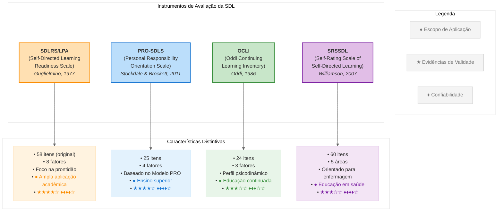

# Tabela Comparativa dos Instrumentos de Avaliação da Aprendizagem Autodirigida (SDL)

## Visão Geral dos Principais Instrumentos

## Tabela Comparativa Detalhada

| **Característica**                                | **SDLRS/LPA (Guglielmino)**                                                                                                                                                                                              | **PRO-SDLS (Stockdale & Brockett)**                                                                                     | **OCLI (Oddi)**                                                                                            | **SRSSDL (Williamson)**                                                                                              |
| :------------------------------------------------ | :----------------------------------------------------------------------------------------------------------------------------------------------------------------------------------------------------------------------- | :---------------------------------------------------------------------------------------------------------------------- | :--------------------------------------------------------------------------------------------------------- | :------------------------------------------------------------------------------------------------------------------- |
| **Ano de desenvolvimento**                        | 1977; revisões em 1991 e 2010                                                                                                                                                                                            | 2011                                                                                                                    | 1986; revisão 1990                                                                                         | 2007                                                                                                                 |
| **Base teórica subjacente**                       | Técnica Delphi com especialistas; Andragogia de Knowles                                                                                                                                                                  | Modelo de Orientação de Responsabilidade Pessoal (PRO) de Brockett & Hiemstra                                           | Perspectiva psicodinâmica sobre aprendizagem contínua                                                      | Baseado em revisão de literatura de SDL e educação em enfermagem                                                     |
| **Número de itens e formato**                     | 58 itens; escala Likert de 5 pontos                                                                                                                                                                                      | 25 itens; escala Likert de 5 pontos                                                                                     | 24 itens; escala Likert de 7 pontos                                                                        | 60 itens; escala Likert de 5 pontos                                                                                  |
| **Dimensões/fatores avaliados**                   | 8 fatores: abertura à aprendizagem, autoconceito como aprendiz eficaz, iniciativa e independência, aceitação de responsabilidade, amor pela aprendizagem, criatividade, orientação futura, habilidades básicas de estudo | 4 fatores: iniciativa, controle, autoeficácia, motivação                                                                | 3 fatores: abertura à aprendizagem, autoconceito como aprendiz eficaz, comprometimento com a aprendizagem  | 5 áreas: consciência, estratégias de aprendizagem, atividades de aprendizagem, avaliação, habilidades interpessoais  |
| **Propriedades psicométricas**                    | **Validade**: Amplamente testada, evidências de validade de construto e concorrente **Confiabilidade**: Alta consistência interna (α=0.87-0.92)                                                                       | **Validade**: Boa validade de construto, correlação com SDLRS **Confiabilidade**: Alta consistência interna (α=0.91) | **Validade**: Moderada validade de construto **Confiabilidade**: Consistência interna razoável (α=0.83) | **Validade**: Moderada validade de conteúdo e de construto **Confiabilidade**: Alta consistência interna (α=0.90) |
| **Contextos típicos de aplicação**                | Educação superior, formação profissional, educação de adultos; mais de 500 estudos publicados                                                                                                                            | Educação superior, especialmente Estados Unidos                                                                         | Educação continuada, desenvolvimento profissional                                                          | Educação em enfermagem e saúde                                                                                       |
| **Limitações e críticas principais**              | Controvérsias sobre validade de construto; custo para uso; possível viés cultural; complexidade dos fatores                                                                                                              | Base de validação mais limitada; menos estudos independentes                                                            | Menor reconhecimento na literatura; estrutura fatorial questionada em alguns estudos                       | Especificidade para área de enfermagem; menos estudos de validação em outras áreas                                   |
| **Adaptações/validações no contexto brasileiro**  | Adaptado e validado por estudos em português; usado em pesquisas no Brasil desde 2010                                                                                                                                    | Poucos estudos de validação no contexto brasileiro                                                                      | Sem validação significativa no Brasil                                                                      | Adaptado para português em alguns estudos na área de saúde                                                           |
| **Avaliação de adequação para pesquisa**          | ★★★★☆                                                                                                                                                                                                                    | ★★★★☆                                                                                                                   | ★★★☆☆                                                                                                      | ★★★☆☆                                                                                                                |
| **Avaliação de adequação para prática educativa** | ★★★★☆                                                                                                                                                                                                                    | ★★★☆☆                                                                                                                   | ★★★☆☆                                                                                                      | ★★★★☆                                                                                                                |
| **Avaliação de adequação para autodiagnóstico**   | ★★★☆☆                                                                                                                                                                                                                    | ★★★★☆                                                                                                                   | ★★★☆☆                                                                                                      | ★★★★☆                                                                                                                |

## Análise Comparativa dos Instrumentos

### SDLRS/LPA de Guglielmino

**Pontos fortes:**

- Instrumento mais amplamente utilizado e citado na literatura sobre SDL
- Extensa base de pesquisa apoiando sua validade
- Aplicável a diversos contextos educacionais e culturais
- Permite comparações com ampla literatura existente

**Limitações:**

- Custo para uso em larga escala
- Complexidade da estrutura fatorial
- Algumas críticas sobre viés cultural e socioeconômico
- Extensão do instrumento pode dificultar aplicação

### PRO-SDLS de Stockdale e Brockett

**Pontos fortes:**

- Base teórica sólida no modelo PRO
- Boa confiabilidade e validade em estudos iniciais
- Mais curto e direto que o SDLRS
- Foco específico em aspectos de responsabilidade pessoal

**Limitações:**

- Menor número de estudos de validação independentes
- Principalmente validado com estudantes universitários nos EUA
- Menor adaptabilidade cross-cultural demonstrada

### OCLI de Oddi

**Pontos fortes:**

- Abordagem psicodinâmica única
- Foco em aspectos de personalidade relacionados à aprendizagem contínua
- Bom para identificar características pessoais duradouras

**Limitações:**

- Menor aceitação na literatura principal sobre SDL
- Questionamentos sobre estrutura fatorial em alguns estudos
- Menos adaptado para contextos educacionais formais

### SRSSDL de Williamson

**Pontos fortes:**

- Desenvolvido especificamente para o contexto de saúde
- Boas propriedades psicométricas em seu campo específico
- Estrutura clara com foco em áreas práticas de SDL
- Útil para autoavaliação e desenvolvimento

**Limitações:**

- Aplicabilidade limitada fora da área de saúde
- Menos estudos de validação em diferentes contextos
- Extensão considerável (60 itens)

## Implicações para Seleção de Instrumento

A escolha do instrumento mais adequado para avaliação da SDL deve considerar:

1. **Propósito da avaliação**: Pesquisa, diagnóstico, desenvolvimento ou intervenção educacional

2. **Contexto específico**: Educação formal, desenvolvimento profissional, aprendizagem ao longo da vida

3. **População-alvo**: Estudantes universitários, profissionais, educação continuada

4. **Recursos disponíveis**: Tempo para aplicação, possibilidade de uso de instrumentos comerciais

5. **Propriedades desejadas**: Ênfase em prontidão, características pessoais ou comportamentos específicos

Para o contexto brasileiro, especialmente em educação superior, o SDLRS/LPA continua sendo a escolha mais respaldada pela literatura, enquanto o PRO-SDLS representa uma alternativa promissora com base teórica sólida e formato mais conciso. O SRSSDL é particularmente relevante para contextos educacionais em saúde.

## Recomendações para Uso em Diferentes Contextos

| **Contexto**                     | **Instrumento Recomendado** | **Justificativa**                                                                         |
| :------------------------------- | :-------------------------- | :---------------------------------------------------------------------------------------- |
| **Pesquisa acadêmica ampla**     | SDLRS/LPA                   | Maior base comparativa na literatura; propriedades psicométricas bem estabelecidas        |
| **Educação superior geral**      | PRO-SDLS                    | Conciso; foco em responsabilidade e controle; boas propriedades psicométricas             |
| **Educação em saúde**            | SRSSDL                      | Desenvolvido especificamente para este contexto; ênfase em aspectos práticos              |
| **Desenvolvimento profissional** | OCLI ou SDLRS               | Foco em características duradouras e disposição para aprendizagem contínua                |
| **Intervenções educacionais**    | PRO-SDLS ou SRSSDL          | Mais diretos na avaliação de comportamentos específicos que podem ser alvo de intervenção |
| **Autodiagnóstico**              | SRSSDL                      | Estrutura clara com categorias compreensíveis para autoavaliação e desenvolvimento        |
